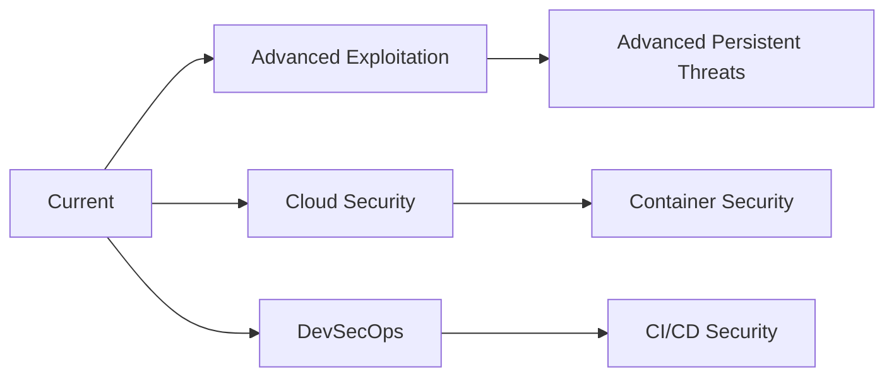

<div align="center">
  
</div>

<div align="center">
  
</div>

<div align="center">
  
  
  
</div>

---


## 🚀 About Me

```yaml
name: Salmon Kumar
role: Cyber Security Engineer
location: ["India", "Remote"]
current_focus: ["Red Teaming", "OSINT", "Bug Bounty"]
learning: ["Advanced Exploitation", "Cloud Security"]

achievements:
  - "Top 2% CTF Player @ TryHackMe"
  - "140+ Security Vulnerabilities Reported"
  - "Penetration Testing Specialist"
  
expertise:
  - Network Penetration Testing
  - Web Application Security
  - API Security Assessment
  - Mobile App Security Testing
  - OSINT & Social Engineering
```

<br clear="right"/>

---

## 🛠️ Arsenal & Tech Stack

<div align="center">

### 🔒 Security Tools


### 💻 Programming & Development


### 🌐 Web Technologies


### 🖥️ Operating Systems & Platforms


</div>

---

## 🎯 Cybersecurity Achievements

<div align="center">
  
### 🏆 Certifications & Rankings


### 🐛 Bug Bounty Stats


</div>

---

## 📊 GitHub Analytics

<div align="center">
  
  
</div>

<div align="center">
  
</div>

<div align="center">
  
</div>

---

## 🏅 GitHub Trophies

<div align="center">
  
</div>

---

## 🔥 Current Focus & Projects

<div align="center">
  
### 🚧 What I'm Working On
- 🔍 **Advanced OSINT Techniques** - Developing automated reconnaissance tools
- 🎯 **Red Team Operations** - Building custom payloads and attack vectors  
- 🛡️ **Cloud Security** - AWS/Azure penetration testing methodologies
- 📱 **Mobile Security** - Android/iOS application security assessment

### 🎓 Learning Path


</div>

---

## 🌐 Connect & Collaborate

<div align="center">
  
### 📱 Social Links
[](https://www.linkedin.com/in/mrrockettt/)
[](https://x.com/mr_rockettt)
[](https://www.instagram.com/mr_rockettt/)
[](https://mrrockettt.github.io/)
[](mailto:your.email@domain.com)

### 🤝 Let's Collaborate
- 💼 **Open for**: Security Consulting, Penetration Testing Projects
- 🔍 **Available for**: Bug Bounty Collaborations, CTF Teams
- 📚 **Sharing**: Security Research, Vulnerability Disclosures
- 🎯 **Interested in**: Red Team Exercises, Security Tool Development

</div>

---

## 💡 Security Quote of the Day

<div align="center">
  
</div>

---

## 📈 Contribution Snake

<div align="center">
  
</div>

---

<div align="center">
  
  
  <br>
  
  **⭐ From [Salmon Kumar](https://github.com/MrRockettt) - Securing the digital world, one vulnerability at a time! ⭐**
  
  
</div>
